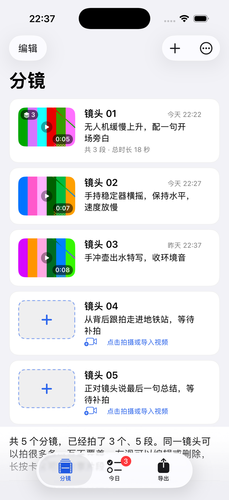
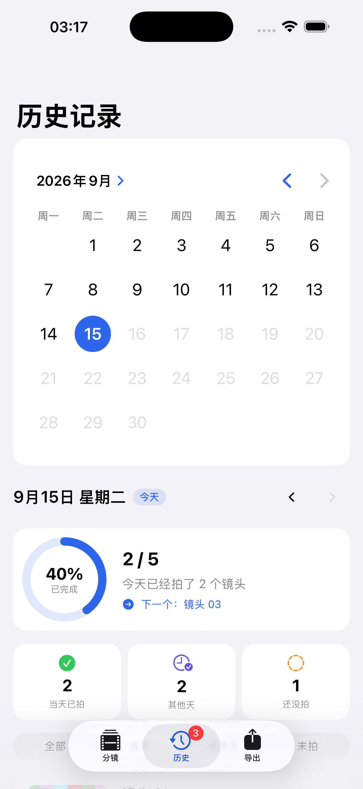
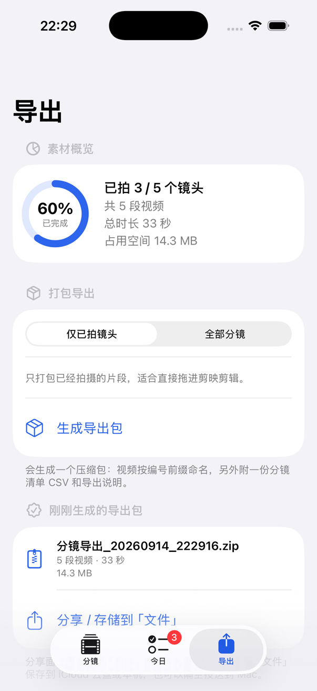
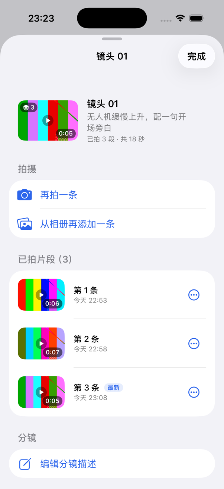
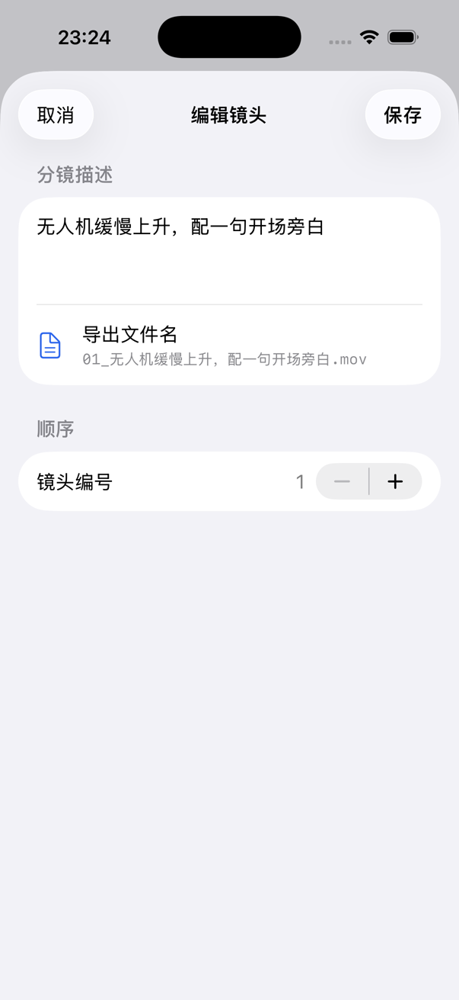
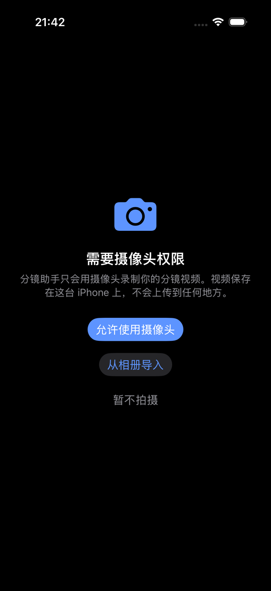
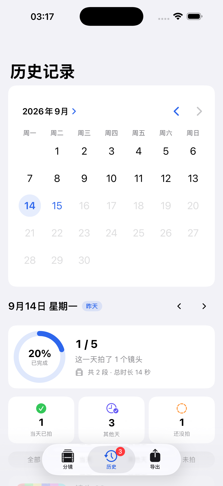
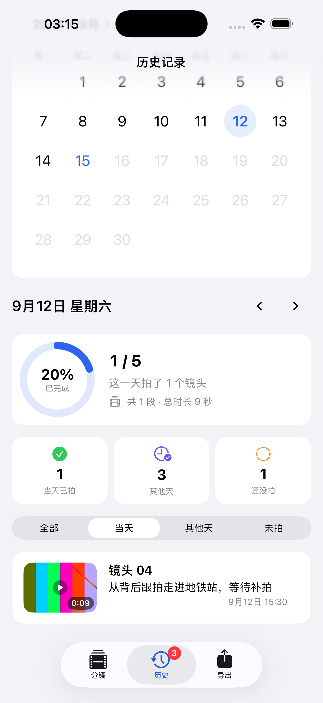

# 分镜助手 · ShotList

一个纯本地单机的 iOS 应用，用来在拍 Vlog 之前把分镜列清楚、拍的时候逐条补拍、拍完统一导出。

- **平台**：iOS 26.0+（原生 SwiftUI，iPhone 竖屏）
- **语言**：Swift 6 语言模式 + 完整严格并发检查（数据竞争在编译期拦下）
- **网络**：零网络请求。所有分镜数据与视频只保存在这台设备上
- **界面语言**：简体中文
- **包标识**：`com.max.ShotList`

---

## 界面

| 分镜清单 | 历史记录 | 统一导出 |
|---|---|---|
|  |  |  |

| 镜头面板与片段列表 | 编辑页（实时预览导出文件名） | 相机权限说明 |
|---|---|---|
|  |  |  |

> 「导出文件名」那一行是编辑描述时实时算出来的，和实际导出的命名走同一个函数——不需要再用一段说明文字告诉用户「描述会被用作文件名」。
> 截图取自 iPhone 17 模拟器，画面中的视频为 `Tools/seed-simulator.py` 灌入的占位素材；无摄像头时的降级界面见 `Docs/screenshots/07-模拟器无摄像头降级.png`。

---

## 功能

### 1. 录入编号 1、2、3… 的镜头分镜
「分镜」标签页支持逐个添加镜头，也可以一次批量添加 3 / 5 / 10 个空白镜头再逐条补描述。
镜头按拍摄顺序连续编号，拖动排序后编号会自动重排；在编辑页直接改编号，镜头会被移动到对应位置。

每个镜头只有一个内容字段——**分镜描述**，写清要拍什么（画面内容、运镜方式、口播要点、道具）。
导出时这段描述会直接变成视频文件名。

### 2. 分镜即「可点击添加视频的模块」
列表里每一张卡片就是一个视频模块，卡片上只有编号、分镜描述和最近一次拍摄的时间：

- 还没有片段时显示虚线框 + 加号，并提示「点击拍摄或导入视频」
- 已经拍过时显示首帧缩略图，**时长压在缩略图右下角**，播放标识居中
- 拍过不止一条时，缩略图左上角标注条数（如 `3`），卡片末行给出总时长与最近一次拍摄时间
- 点击卡片弹出镜头面板：再拍一条 / 从相册再添加 / 逐条播放、分享、删除 / 编辑描述 / 删除分镜

### 3. 一个镜头可以拍很多次，互不覆盖
同一个镜头可以反复拍（「这条没过，再拍一条」），每条都是独立文件、独立时长、独立拍摄时间：

- 相机回看页除了「使用这条」，还有 **「保存并继续拍下一条」**，存完直接回到取景继续拍同一个镜头
- 镜头面板里逐条列出「第 1 条 / 第 2 条 / 第 3 条」，最后一条标「最新」
- 每条可以单独播放、单独分享、单独删除；也可以一键清空这个镜头的全部片段
- 卡片缩略图与导出主素材取**最新一条**，更早的片段收进导出包的「备用片段」目录

### 4. 按日期回看拍摄记录
「历史」标签页用系统月历选日期（最晚选到今天），选中哪天就看哪天：环形进度、
三个可点击的统计块（当天已拍 / 其他天 / 还没拍）与按状态筛选的镜头列表。
默认落在「当天已拍」——进来就是「这一天拍了什么」；回看历史日期时，卡片按
**当天最新一条**片段展示，角标条数与总时长也只算当天拍下的几条。
日历下方的箭头可以前后翻一天；选中今天时保留「下一个」补拍提示。
状态的表达始终是「图标 + 文字 + 颜色」三重信息，不依赖颜色单独区分。




### 5. 应用内直接调用原生摄像
点卡片 → 再拍一条，即可在当前镜头里直接录像（AVFoundation）：

- 先给出自定义权限说明，再触发系统权限弹窗；权限被拒时引导到「设置」
- 支持前后摄像头切换、补光、录制计时
- 录完先回看，可以选择「重拍」「使用这条」或「保存并继续拍下一条」
- 来电、切后台等中断会先把已拍的片段保存下来
- 单条片段最长 10 分钟、最大 600 MB

### 6. 统一管理 + 统一导出
「导出」标签页把所有镜头的片段打包成一个 zip：

```
分镜导出_20260914/
├── 01_无人机缓慢上升，配一句开场旁白.mov     每个镜头的最新一条
├── 02_手持稳定器横摇，保持水平，速度放慢.mov
├── 03_手冲壶出水特写，收环境音.mov
├── 备用片段/
│   ├── 01-1_无人机缓慢上升，配一句开场旁白.mov  同一个镜头第 1 条
│   └── 01-2_无人机缓慢上升，配一句开场旁白.mov  同一个镜头第 2 条
├── 分镜清单.csv      （带 UTF-8 BOM，Excel / Numbers 直接打开不乱码）
├── 分镜文字内容指南.md
└── 导出说明.txt
```

上面按 `.mov` 举例，实际扩展名跟随源文件——相册导入的 mp4 导出后仍是 `.mp4`。
根目录只放每个镜头的主素材，按编号前缀命名，导入剪映后素材顺序与分镜顺序一致；
更早拍的片段另放「备用片段」目录，不导入就不占时间线，想换素材时再去挑。
清单 CSV 一段一行，逐条记录编号、描述、状态、第几条、拍摄时间、时长与导出文件名。

`分镜文字内容指南.md` 是给 AI 剪辑工具读的：把每个镜头的文字描述与包内视频文件名
一一绑定，并写清处理规则（编号即顺序、每个镜头只取主素材、时长不得臆造、未拍的镜头
按编号跳过）。把整个压缩包丢给 AI，它就能直接按分镜处理视频，不需要再问「哪段视频
对应哪个镜头」。

三条导出通道：

| 目标 | 方式 |
|---|---|
| 剪映 | 分享面板里直接选「剪映」 |
| 电脑 | 分享面板选「存储到文件」，或隔空投送到 Mac |
| 数据线 | 应用已开启文件共享，接上数据线后在「文件」App / 访达里直接取用 |

也可以「单独分享某个镜头」，一次把它拍过的所有片段一起分享出去。

---

## 运行

### 直接打开（推荐）

```bash
open ShotList.xcodeproj
```

选好模拟器或真机，`⌘R` 运行。命令行构建：

```bash
xcodebuild -project ShotList.xcodeproj -scheme ShotList \
  -sdk iphonesimulator -destination 'platform=iOS Simulator,name=iPhone 17' \
  -configuration Debug build
```

### 修改工程结构后重新生成

工程文件由 [XcodeGen](https://github.com/yonaskolb/XcodeGen) 根据 `project.yml` 生成。
仓库里同时提交了生成好的 `ShotList.xcodeproj`，方便直接打开；如果改了 `project.yml`
或增删了源文件目录，需要重新生成：

```bash
brew install xcodegen
xcodegen generate
```

### 关于摄像头

**iOS 模拟器不提供摄像头。** 在模拟器里进入拍摄界面时，应用会明确提示
「这台设备没有可用的摄像头」，并给出「从相册导入」的替代路径，不会崩溃或卡死。
完整的拍摄链路需要在真机上验证。

### 灌演示数据（开发用）

截图与人工验收用的演示数据由 `Tools/seed-simulator.py` 写进已安装的 App 容器：
5 条分镜，其中镜头 1 有 3 条片段。脚本每次都用同一批固定文件名，因此跑之前会
先清空容器的「分镜视频」目录，免得上一轮的文件留下来变成无人引用的孤儿。

**前置条件**：`/tmp/slseed/v1.mov` … `v5.mov` 必须存在（脚本只做复制，内容不限）。
缺失时脚本会打印缺哪几个文件并退出，不抛栈。

```bash
python3 Tools/seed-simulator.py            # 只有一台模拟器启动时
python3 Tools/seed-simulator.py <UDID>     # 同时启动多台时，指定设备
```

---

## 目录结构

```
ShotList/
├── App/
│   └── ShotListApp.swift            应用入口，注入数据仓库与区域设置
├── Models/
│   ├── Shot.swift                   分镜与片段模型、拍摄状态、无障碍描述
│   └── ShotStore.swift              数据仓库：JSON 持久化 + 片段文件管理
├── Camera/
│   ├── CameraRecorder.swift         AVFoundation 会话、录制、前后摄、补光、中断处理
│   └── CameraPreview.swift          预览层桥接到 SwiftUI
├── Views/
│   ├── RootTabView.swift            分镜 / 历史 / 导出 三标签
│   ├── ShotListView.swift           分镜清单
│   ├── ShotCardView.swift           可点击添加视频的模块卡片
│   ├── ShotEditorView.swift         编辑分镜描述与编号
│   ├── ShotFlowModifier.swift       拍摄 / 导入 / 播放 / 编辑的统一弹层流程
│   ├── ClipOptionsSheet.swift       镜头面板：续拍 + 逐条片段管理
│   ├── ClipThumbnailView.swift      首帧缩略图（含时长与条数角标）
│   ├── CameraCaptureView.swift      应用内相机（含权限说明与降级路径）
│   ├── ClipPlayerScreen.swift       整屏播放某一条片段
│   ├── HistoryView.swift            历史记录：按日期回看每天的拍摄记录
│   └── ExportView.swift             统一导出
├── Support/
│   ├── DesignSystem.swift           间距、尺寸、编号徽标、进度环、时间线导轨等基础组件
│   ├── AppLocale.swift              格式化区域固定为简体中文
│   ├── ExportPackageBuilder.swift   打包 zip、分镜清单、导出说明
│   ├── Haptics.swift                触觉反馈、视频元数据、缩略图缓存
│   └── MediaImport.swift            相册导入的 Transferable 实现
└── Resources/
    └── Assets.xcassets              应用图标与强调色（含深色变体）

Tools/
├── generate-icon.swift              用 CoreGraphics 生成 1024×1024 应用图标
└── seed-simulator.py                开发辅助：往模拟器里灌演示数据（先清空旧数据）

project.yml                          XcodeGen 工程定义（权限键、部署目标等）
```

---

## 数据存放位置

| 内容 | 位置 |
|---|---|
| 分镜元数据 | `Application Support/ShotList/shots.json` |
| 分镜片段 | `Documents/分镜视频/`，命名形如 `镜头01_20260914_120001.mov` |
| 导出压缩包 | 临时目录，分享完即可丢弃 |

`Documents` 目录已通过 `UIFileSharingEnabled` 与 `LSSupportsOpeningDocumentsInPlace`
对「文件」App 和访达开放，因此片段不需要额外导出就能取到电脑。
磁盘上的文件名会跟随镜头编号一起更新，所以「文件」App 里看到的序号和应用里的顺序始终一致。

目录开放也意味着可以往里直接拖视频。这类文件不属于任何分镜，不会被导出带走，
也不计入「素材概览」的占用空间；导出页检测到它们时会给出「清理未使用的文件」入口，
把它们的数量与体积一并列出来。

片段文件在外部被删掉（或目录一时读不到）都不会动 `shots.json` 里的记录：
启动与每次回到前台都会拿磁盘实况对齐一次内存，**只有目录确实枚举成功时**才会剔除
已经消失的片段——目录读不到时「文件不存在」和「整个目录读不到」是同一个结果，
按前者处理会一次抹掉全部记录。

---

## 数据兼容

`shots.json` 的读取兼容早期版本：老数据里每个镜头只有一段视频
（`clipFileName` / `clipDuration` / `recordedAt`），读取时会自动折算成一条片段；
已经废弃的 `title` 字段会被忽略，只保留分镜描述。

---

## Apple 开发标准与无障碍

- **导航**：`TabView` 三个顶层标签（iOS 26 新版 `Tab` 写法），无抽屉菜单；
  列表向下滚动时标签栏自动收起、回到顶部再展开；
  `NavigationStack` 层级导航；不覆盖系统返回手势
- **触控**：所有可点元素不小于 44×44pt；间距遵循 8pt 网格（4pt 仅用于细调）
- **排版**：全部使用语义化文字样式，支持 Dynamic Type；无障碍字号下卡片自动改为上下布局
- **颜色**：全部使用语义色与系统色；自定义强调色在资源目录里提供了深色变体
- **无障碍**：交互元素均有 `accessibilityLabel` / `accessibilityHint`；
  卡片会一次朗读「镜头编号 + 描述 + 状态 + 片段数 + 时长 + 可执行动作」；
  缩略图上的时长与条数角标不重复朗读，由卡片朗读文本统一表达；
  进度环、录制计时等有独立的无障碍值；状态不依赖颜色单独传达
- **减弱动态效果**：卡片按压缩放、进度环动画、录制红点闪烁在开启后全部关闭
- **权限**：在用户点开相机时才申请，且先给出自定义说明；被拒后引导至「设置」
- **模态**：不使用叠层模态，切换弹层时先关闭当前弹层再呈现下一个；弹层均提供关闭路径
- **提示与反馈**：删除分镜、删除单条片段、清空片段使用 `confirmationDialog` / `alert`
  二次确认并标红；关键操作配合触觉反馈；导入过程用轻量胶囊提示，不用全屏 spinner
- **生命周期**：录制中切后台或来电会先保存已拍片段；回看结束回到取景时会切回录音模式，
  避免续拍丢声音

---

## 工具链与并发

工程按 Xcode 26 的当前默认组合配置（见 `project.yml`）：

| 设置 | 值 | 作用 |
|---|---|---|
| `IPHONEOS_DEPLOYMENT_TARGET` | `26.0` | 以 iOS 26 为开发基线，不再需要可用性分支 |
| `SWIFT_VERSION` | `6.0` | Swift 6 语言模式，数据竞争在编译期检查 |
| `SWIFT_STRICT_CONCURRENCY` | `complete` | 完整严格并发检查 |
| `SWIFT_APPROACHABLE_CONCURRENCY` | `YES` | 贴向主协程的并发默认值 |
| `SWIFT_DEFAULT_ACTOR_ISOLATION` | `MainActor` | 未标注隔离的代码默认落在主协程 |

「默认落在主协程」意味着**纯数据与后台工作必须显式说明自己不属于主协程**，否则编译器会拦下来。
这条规则把线程归属推到了类型签名上：

- **模型**：`Shot`、`ShotClip`、`ShotStatus`、`SLDateText`、`SLTimecode`、
  `ExportPackageBuilder` 全是 `nonisolated` 值类型 —— 读一条分镜不该要求主线程，
  导出打包也因此能在后台跑
- **数据仓库**：`ShotStore` 显式 `@MainActor`，是界面状态的唯一入口
- **导出打包**：`buildOffMain` 标注 `@concurrent`，把复制视频、压缩这些重 I/O
  真正放上后台线程；结果以 `Sendable` 的形式回传给界面
- **缩略图**：缓存由主协程持有，首帧解码走 `@concurrent`，
  界面拿到的永远是主线程上的 `UIImage`
- **相机**：`AVCaptureSession.startRunning()` 是阻塞调用，不能放主线程。
  控制器本身 `nonisolated`，自己划分三块归属 —— 界面状态显式 `@MainActor`（编译器保证只有主线程能写）、
  会话状态只在独立串行队列上访问、预览层等主线程资源只在主线程访问；
  跨域传递用最小的 `MainOnly` 壳标注，而不是给整个类打开不安全开关

> 一个容易踩的坑：`nonisolated async` 函数在「贴主协程」模式下会**留在调用方的主线程上**，
> 想真正离开主线程必须标注 `@concurrent`。

---

## 已知限制

- 仅支持 iPhone 竖屏。这是相机类应用的刻意取舍，避免上下颠倒的录制结果
- 视频编码使用系统默认的 H.264，未提供码率 / 分辨率选项
- 导出主素材固定取每个镜头的最新一条，不能手动指定「用第几条」；
  需要换素材时到「备用片段」目录里挑
- 导出包生成在临时目录，系统回收后需要重新生成
